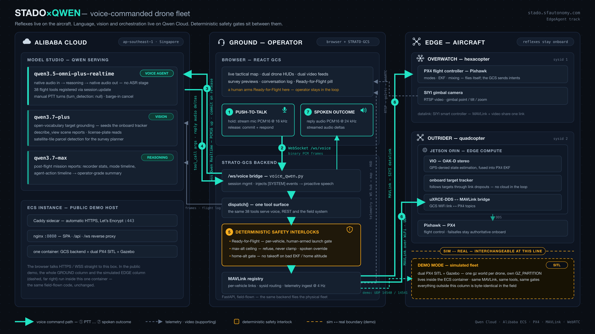
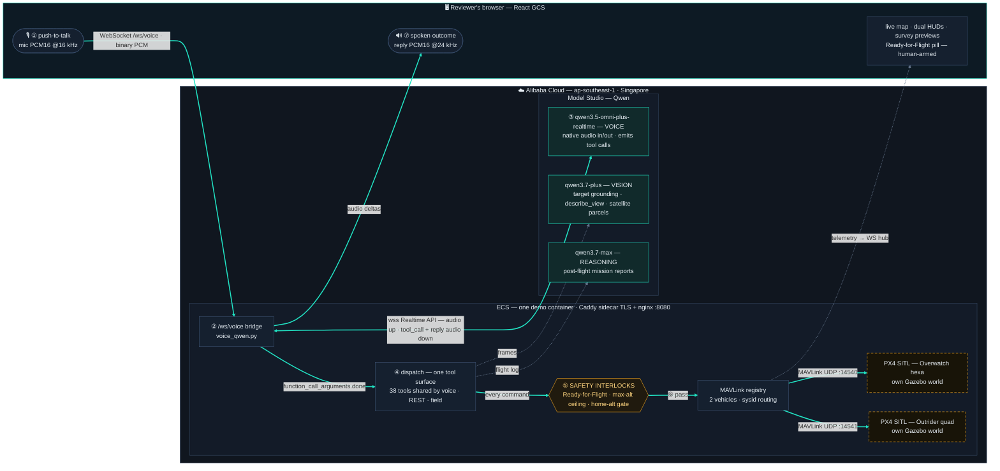
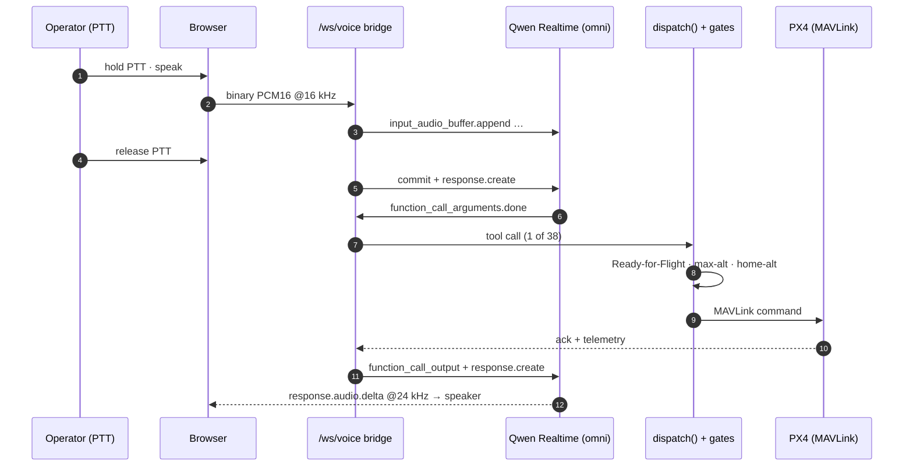
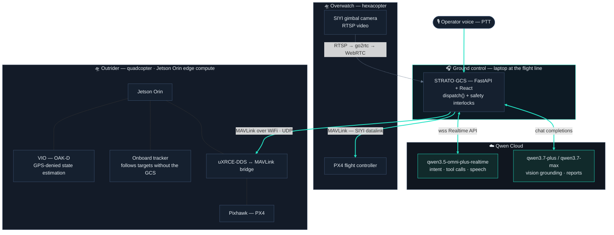

# Architecture



> **For-print / Devpost version:** [`architecture.png`](architecture.png) ·
> [`architecture.svg`](architecture.svg) · self-contained
> [`architecture.html`](architecture.html) (open offline in any browser).

## The demo (this repo, deployed on Alibaba Cloud ECS)

One Docker container simulates the whole fleet; Qwen Cloud (Alibaba Cloud
Model Studio) is the only external service in the loop. The teal path below
is the whole story in one trace: **① PTT → ② WebSocket → ③ Qwen Realtime →
④ tool call → ⑤ safety gates → ⑥ MAVLink → PX4 → ⑦ spoken outcome**.



The two SITL nodes are drawn dashed for a reason: that is the **sim ↔ real
boundary**. In the field the same `MAVLink registry` speaks to a Pixhawk
over a SIYI datalink and to a Jetson bridge over WiFi (diagram below) —
nothing left of that boundary changes.

### The voice round-trip



1. **PTT press** → browser starts streaming raw mic PCM frames over
   `/ws/voice`; the bridge forwards each as `input_audio_buffer.append`
   (manual turn detection — `turn_detection: null`).
2. **PTT release** → `input_audio_buffer.commit` + `response.create`.
3. Qwen transcribes + reasons **natively on audio** (no ASR stage) and either
   answers or emits a tool call (`response.function_call_arguments.done`).
4. The bridge runs the tool through `dispatch()` — the same dispatcher the
   REST API and the field system use, including the **Ready-for-Flight
   interlock** (voice can't launch a drone until a human arms the gate in
   the UI) — then returns `function_call_output` + `response.create`.
5. Qwen speaks the outcome; `response.audio.delta` chunks stream back to the
   browser as binary PCM. Transcripts flow alongside (`heard`/`said` events)
   for the on-screen conversation log.
6. Backend-initiated events (takeoff completed, low battery) are injected
   into the session as `[SYSTEM]` turns, so STADO *proactively speaks*
   ("Overwatch has reached 30 meters").

### One tool surface, three models

- The 38 tool declarations are defined **once**, in `voice.py`, as plain
  OpenAI-style JSON-Schema function dicts — the realtime session registers
  them in `session.update`, and the REST surface dispatches through the same
  schema. Zero drift between what the model can call and what the GCS can do.
- Vision-backed tools (`describe_view`, `track_target`, survey perimeter
  detection, plate reads) call **qwen3.7-plus** through
  [`backend/app/qwen.py`](backend/app/qwen.py), the shared chat-completions
  client on Model Studio's OpenAI-compatible endpoint.
- Mission-report summaries call **qwen3.7-max** on the same endpoint. Every
  non-realtime call degrades gracefully — no key or a network blip falls
  back to deterministic behavior, never a crash.

Qwen Realtime's audio contract (PCM16 16 kHz up / 24 kHz down) is exactly
what the browser pipeline streams — the frontend does no transcoding.

### The safety interlocks (why the amber box exists)

Every model-initiated action passes deterministic gates *before* a single
MAVLink byte leaves the dispatcher — the model is powerful, the dispatcher
stays paranoid:

- **Ready-for-Flight** — a per-vehicle, human-armed software interlock.
  Voice cannot launch a drone until the operator arms the pill in the UI.
- **Max-altitude ceiling** — one fleet-wide ceiling enforced on every
  altitude-bearing command. It **refuses, never silently clamps**; raising
  it requires an explicit spoken override, which is audit-logged
  ([`backend/app/safety.py`](backend/app/safety.py)).
- **Home-alt gate** — takeoff is blocked when PX4's home/EKF altitude
  reference is visibly wrong (a real field incident: a ~2.3 m home offset
  produced a "stuck armed, no climb" hexacopter — the gate now catches it
  on the ground).

## The real system (what the demo is a simulation of)

The same GCS + agent layer flies physical drones. This is the edge↔cloud
split the EdgeAgent track is about: reflexes live at the edge, language
and orchestration live in the cloud.



- **Edge**: the Jetson runs visual-inertial odometry and target tracking
  onboard — the drone keeps flying and tracking through GCS/datalink
  dropouts. Tracking/yaw commands never round-trip through the cloud.
- **Cloud**: Qwen handles what edge silicon can't — open-vocabulary speech
  understanding, multi-step tasking ("survey the area and split it between
  both drones"), open-vocabulary target grounding to *seed* the onboard
  tracker, and spoken situation reports.
- **Ground**: the GCS is the trust boundary. Every model-initiated action
  passes deterministic safety gates *before* a single MAVLink byte goes out.

## Demo container internals

Two PX4 SITL instances would starve each other sharing one Gazebo physics
server (sensor watchdog → arming refused — learned on a shared-scheduler
cloud platform). So each PX4 gets its **own Gazebo world** in its own
`GZ_PARTITION`, i.e. a dedicated gz-sim process per drone:

```
entrypoint.sh
 ├─ PX4 SITL i0 (Overwatch, sysid 1) ── gz world "default"   → MAVLink :14540
 ├─ (8s stagger)
 ├─ PX4 SITL i1 (Outrider,  sysid 2) ── gz world "default2"  → MAVLink :14541
 ├─ uvicorn app.main:app (127.0.0.1:8000)
 ├─ px4-relax-preflight.py (one-shot: disable RC-loss/battery-sim failsafes)
 └─ nginx :8080 (foreground)
```

SITL-only patches (all idempotent, all in `scripts/`): TAKEOFF-mode-first
arming (`patch_commands_takeoff.py` — also field-proven under baro drift),
preflight relaxation, camera panels hidden, map centered on the SITL spawn.
